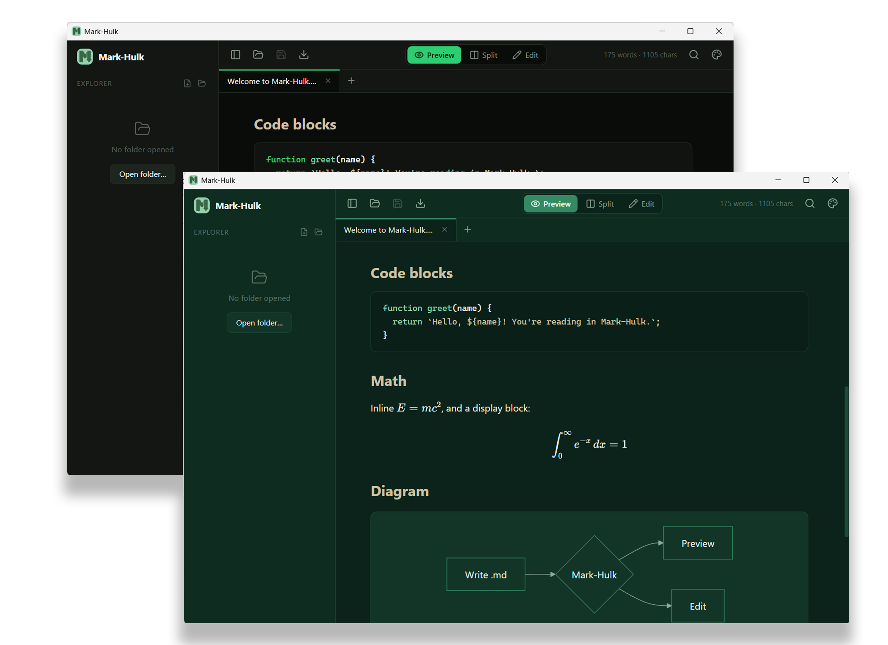

# Mark-Hulk

A fast, lightweight **native** Markdown viewer and editor for Linux — no web
engine, instant cold start, tiny memory footprint. The name has *Hulk* in it for
a reason: it's green.

Built with **GTK4 + libadwaita** and **Rust**. The editor is **GtkSourceView 5**;
the preview is rendered natively to Pango markup. Because there is no embedded
browser, a window idles at **~45 MB** of memory instead of the ~330 MB a
WebView-based build of the same app used.



## Features

- **Native, no web engine** — GTK4/libadwaita shell, single process.
- **Tabbed editing** — open many documents (AdwTabView); each tab tracks its
  own unsaved state.
- **Three view modes** — Preview, Split (live), and Edit.
- **GtkSourceView 5 editor** — markdown highlighting, line numbers, soft-wrap.
- **Native preview** — headings, lists, task lists, tables, blockquotes, and
  **syntax-highlighted** code blocks (syntect).
- **Workspace explorer** — open a folder and browse its `.md` tree.
- **Cross-file search** — search the whole workspace and jump to a result.
- **File watcher** — the open file auto-reloads when it changes on disk.
- **File association** — open `.md` files from your file manager.
- **Two green themes** — "Forest Sage" and "Dark Emerald", switched live from a
  header menu (the editor recolors with the rest of the UI).
- **Hideable sidebar** — toggle from the header or with `Ctrl+B`.

> Math (KaTeX) and diagrams (Mermaid) from the old WebView build are **not**
> included by design — rendering them natively would require a browser engine,
> which is exactly the weight this rewrite removes.

## Keyboard shortcuts

| Shortcut       | Action             |
| -------------- | ------------------ |
| `Ctrl+S`       | Save               |
| `Ctrl+N`       | New file           |
| `Ctrl+B`       | Toggle sidebar     |
| `Ctrl+Shift+F` | Search workspace   |
| `Ctrl+1/2/3`   | Preview/Split/Edit |

## Development

Install the GTK4 build dependencies (Fedora):

```bash
./scripts/setup-fedora.sh   # gtk4-devel, libadwaita-devel, gtksourceview5-devel
```

On other distributions install the equivalents: `gtk4`, `libadwaita`,
`gtksourceview-5`, and a Rust toolchain.

```bash
cargo run            # build and launch
cargo build          # debug build
```

## Install

```bash
./scripts/install.sh   # release build + .desktop launcher + icon (no root)
```

This installs the binary to `~/.local/bin`, registers a launcher, and lets you
open `.md` files with Mark-Hulk from your file manager. To make it the default:

```bash
xdg-mime default com.sarta.mark-hulk.desktop text/markdown
```

### Build an `.rpm` (Fedora)

```bash
cargo install cargo-generate-rpm     # once
cargo build --release && cargo generate-rpm
sudo dnf install ./target/generate-rpm/mark-hulk-*.x86_64.rpm
```

## Project layout

```
src/main.rs        GTK4 app: window, tabs, sidebar, editor, preview, search
src/markdown.rs    pulldown-cmark -> Pango markup, syntect code highlighting
src/fs.rs          workspace tree, read/write, cross-file search
src/watcher.rs     notify-based file watcher (auto-reload)
src/style.rs       green palette (CSS) + editor style scheme
data/              editor scheme, .desktop launcher
scripts/           setup-fedora.sh, install.sh
```

## Tech stack

| Layer    | Choice                                  |
| -------- | --------------------------------------- |
| Shell    | GTK4 + libadwaita (Rust, no web engine) |
| Editor   | GtkSourceView 5                         |
| Markdown | pulldown-cmark + syntect                |

## License

MIT
